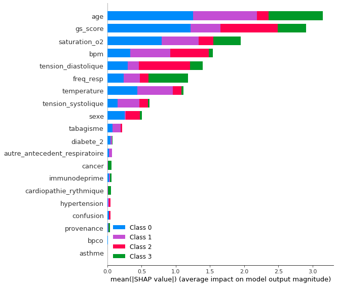

---
title: ACUPen Presentation
...

# EchOpen Data Challenge

## Goal

- Predict a COVID-19 patient's clinical outcome
- Using Machine Learning

## Dataset

- Pulmonary ultrasound scores
- 327 patients from AP-HP hospitals
- Tabular format with other indicators

# Data analysis and wrangling

## Interpretation of the data

- Data is not balanced
- Correlation between indicators

## Cleaning the data

- Change strings into usable format (boolean, integers, float, etc.)
- Hierarchy for the severity of each zones and the outcome
- Columns dropped: low correlation/too much missing data
- Imputation of missing data

## Tackling class imbalance

- Oversampling of intensive care unit and death
- Undersampling of patients going home or hospitalized

# Machine learning model

## XGBoost: eXtreme Gradient Boosting 

- Supervised learning
- Combination of many algorithms
- Weak learners become strong learners

## Feature importance

## Tuning the model

- Simple grid search
- Using cross validation

# Results

## Validation set

- 67 patients in the validation set (30% of the training data)
- Weighted F1-score of 0.87

## Confusion matrix

# Conclusion

## Conclusion

- Data was rebalanced
- A lot of missing data was imputed
